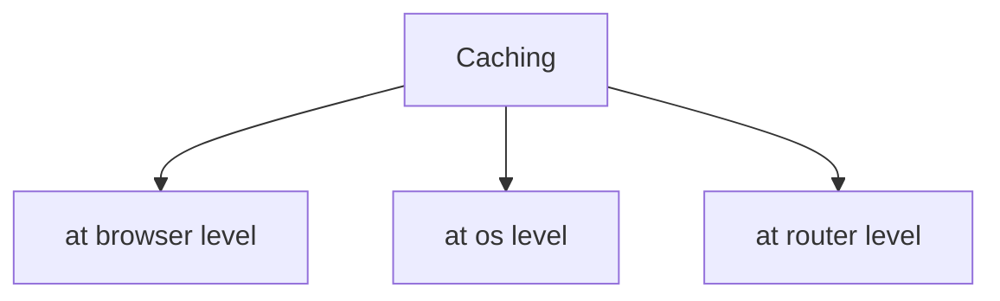

<<<<<<< HEAD
# web-technologies-notes
📚 Comprehensive notes on Web Development covering browser rendering, networking, HTML5, CSS, Git &amp; GitHub, responsive design, Flexbox, Grid, browser caching, HTTP/HTTPS, and other core concepts. Ideal for BCA students, beginners, and interview preparation.
=======
# Web Development Summary Notes
>quick revision guide covering fundamental concepts of ***Networking, Git, GitHub, HTML and CSS.***
>
---

## How a Weabsite Loads in Browser?
When someone enters url in browser and hits enter, the browser follows multi-step process.

The process occurs in **5 main steps**:
```
User enters URL
        │
        ▼
+----------------------+
| 1. DNS Lookup        |
| Find IP Address      |
+----------------------+
        │
        ▼
+----------------------+
| 2. TCP Connection    |
| Three-Way Handshake  |
+----------------------+
        │
        ▼
+----------------------+
| 3. TLS Handshake     |
| (HTTPS only)         |
| Secure Encryption    |
+----------------------+
        │
        ▼
+----------------------+
| 4. HTTP Request      |
| Browser → Server     |
| Server → Response    |
+----------------------+
        │
        ▼
+----------------------+
| 5. Browser Rendering |
| HTML + CSS + JS      |
| → Display Webpage    |
+----------------------+
```

1.**DNS(Domain Name System)**: The browser checks the Domain Name System (DNS) to translate the human-readable domain (like shorterloop.com) into a machine-readable IP address.
```
DNS Manager:DNS Managers are services or software used to manage DNS records
 for a domain. They control how a domain name is translated into an IP 
 address and direct internet traffic to the correct servers.
 Common DNS Managers:- Cloudflare, GoDaddy, Namecheap
```
2.**TCP(Transmission Control Protocol)**:The browser establishes a reliable connection with the web server using the TCP three-way handshake (SYN → SYN-ACK → ACK).
```
Browser                  Server
   |                        |
   | ------ SYN ----------> |
   |                        |
   | <--- SYN + ACK ------- |
   |                        |
   | ------ ACK ----------> |
   |                        |

Connection Established
```
3.**TLS(Transport Layer Security)**:If the website uses HTTPS, the browser and server perform a TLS handshake to create a secure, encrypted connection.
```
Browser
     │
     │ Request Secure Connection
     ▼
Server
     │
     │ Sends SSL/TLS Certificate
     ▼
Browser
     │
     │ Verifies Certificate
     ▼
Secure Encrypted Connection
```
4.**HTTP(Hypertext Transfer Protocol)**:The browser sends an HTTP request to the server, and the server responds with the website files (HTML, CSS, JavaScript, images, etc.).

```
             HTTP Request
        --------------------->
Browser|                         |Server
        <---------------------
            HTTP Response
```
5.**Rendering**:The browser processes the received files, builds the webpage, applies styles, executes JavaScript, and displays the final webpage to the user.
*(The browser performs Parse HTML, Create DOM, Download CSS, Create CSSOM, Execute JavaScript, Combine DOM + CSSOM, Paint webpage)*

## TCP And UDP
| TCP | UDP |
|:------:|:------:|
| Transmission Control Protocol | User Datagram Protocol |
| Connection oriented | Connectionless |
| Reliable data transmission | Less reliable data transmission |
| Retransmits lost packets | does not retransmit lost packets |
| Slower | faster |
| More secure | Less secure |
| Used in Web browsing, Email, File Transfer | Used in Video streaming, Online gaming |

## Caching
Caching is the process of storing frequently accessed data in a temporary storage area called a cache, so that future requests for the same data can be served faster without fetching it again from the original source.<br>
Hence, caching improves website performance by reducing the time required to load data.<br>

*When the user visits the same webpage again, the browser checks its cache first.If the required files are available and still valid, they are loaded directly from the cache instead of the server.*<br>
types of caching:


## HTTP and HTTPS
| HTTP | HTTPS  |
|:------:|:------:|
| HyperText Transfer Protocol | HyperText Transfer Protocol Secure |
| Used to transfer data between a browser and a web server. | Secure version of HTTP that encrypts data during transmission. | 
| Data is sent in plain text(not encrypted). | Data is encrypted using TLS. |
| Does not require security certificate. | Requires security certificate. |
| URL begins with http:// | URL begins with https:// and displays a padlock icon in the browser. |
| Browser ---- Plain Text ----> Server | Browser=== Encrypted Data ===>Server |

## Shared and Dedicated Server

| Shared Server | Dedicated Server  |
|:------:|:------:|
| Multiple websites share the same server and its resources. |	One entire server is used by a single website or organization. |
| Less expensive. |	More expensive. |
| Performance may decrease due to traffic.	| Provides consistent and high performance. |
| Limited control over server settings.	| Full control and customization of the server. |
| Suitable for small websites, personal projects. |  Suitable for large websites, e-commerce platforms. |

## HTML(Hyper Text Markup Language)
HTML (HyperText Markup Language) is the ***standard markup language*** used to create and structure web pages. 
-It defines the content of a webpage using elements called tags, such as headings, paragraphs, images, links, tables, and forms.
  ***Markup Languages*** 
  -Defines the structure of a document.
  -Uses tags.
  -Does not have any logics , variables, functions unlike programming languages.
  -example: HTML, XML.
  -Used to create web pages and structured documents.

 ### HTML5 and Semantic Tags
 HTML5 is the fifth and latest major version of HTML<br>
 -It introduces new semantic elements, multimedia support, graphics, and APIs, making it easier to build modern, interactive, and responsive websites without relying on external plugins.<br>
 -Includes form enhancements with new input types such as email, date, number, and range.<br>

 **Semantic tags** are HTML5 elements that clearly describe the purpose and meaning of the content they contain. They make the webpage easier for developers, browsers, and search engines to understand.<br>

 -Unlike generic tags such as **div** and **span**, semantic tags indicate the role of different sections of a webpage.<br>
 -Common Semantic tags: ***header, footer, aside, main, article, nav, section, figure, img etc.***.<br>
```
Why do we use semantic tags?
 --It improves code readability.
 --Enhances SEO (Search Engine Optimization).
 --Makes websites more accessible for screen readers.
 --Easier to maintain and understand.
```

***#NOTE***
div and span are useful generic containers, overusing them *reduces code clarity and negatively affect Search Engine Optimization*, instead tags like **header, footer, main, aside, are used in place of div tag**. Similarly, table should be used only for tabular data as it slowers rendering and is not very responsive, while modern layouts should be created using **Flexbox or CSS Grid**.

## CSS
### What is CSS?
 CSS (Cascading Style Sheets) is used to style HTML webpages and improve their appearance.<br>

 CSS is used to change the look and feel of a webpage.<br>
 CSS makes the website more presentable and attractive.<br>

### Ways to Embed CSS in HTML File:
  --Inline CSS<br>
  --Internal CSS<br>
  --External CSS<br>

 | Method | Location | Best Use |
 |:------:|:------:|:------:|
 | Inline CSS |	Inside the HTML element (style attribute) |	Small changes or testing |
 | Internal CSS |	Inside the style tag in the head |	Single-page websites |
 | External CSS |	Separate .css file |	Multi-page websites (Recommended) |


  ***#NOTE***
   -External CSS is the best method because it keeps HTML and styling separate and ensure code reusability.<br>
   -Inline CSS is less popular because they make websites incredibly difficult to maintain and break the concept of code reusability.<br>

### CSS Selectors
    -Universal Selector (*) 
    -Class Selector(.classname) 
    -id  Selector(#idname)
    -Element Selector(p,h1,etc)
    -Nested Selector(.sidebar h2)

### CSS layouts
i. ***Flexbox (Flexible Box Layout)***: Flexbox is a one-dimensional CSS layout model used to arrange elements in a row or a column. It makes it easy to align, distribute, and space items within a container.<br>

-It is ideal for creating responsive layouts where elements need to adjust their size and position automatically.
```
+-------------------------------------------------+
|  Item 1  |  Item 2  |  Item 3  |  Item 4        |
+-------------------------------------------------+
```
-Used in header, footer , navigation bar, Buttons and menus, Forms and Horizontal or vertical alignment.

ii. ***CSS Grid***: CSS Grid is a two-dimensional layout system that arranges elements in rows and columns. It is designed for creating complex webpage layouts.
```
+---------+---------+
| Item 1  | Item 2  |
+---------+---------+
| Item 3  | Item 4  |
+---------+---------+
```
-Used in Dashboards, Image galleries, Product listings, Magazine-style layouts and Admin panels.

iii. ***Masonry Layout***: A Masonry Layout is a layout in which items of different heights are arranged in columns, filling empty spaces efficiently. It looks similar to a brick wall, where each item fits into the available space without leaving large gaps.<br>

This layout is commonly **used on websites that display images or cards of varying heights.**
```
+-------+-------+-------+
|   A   |       |   C   |
|       |       |       |
+-------+   B   +-------+
|   D   |       |   E   |
|       +-------+       |
+-------+       +-------+
|   F   |   G   |  I     |
+-------+-------+-------+
```
-Used in Photo galleries, Pinterest-style websites, Product catalogs, Portfolio websites and Blog card layouts

### JPG and PNG Image Formats
#### JPG
-JPG (or JPEG) is a lossy image format, which reduces file size by removing some image data. <br>
-It is best suited for photographs and realistic images, where a small reduction in quality is usually not noticeable.<br>
-Smaller file size.<br>
-Does not support transparency.<br>

#### PNG
-PNG is a lossless image format, which means it preserves the original image quality without losing data during compression.<br>
-It also supports transparent backgrounds, making it ideal for graphics, logos, icons, and images with text.<br>
-Larger file size<br>
-Supports transparency<br>

***#NOTE***
Responsive Web Design<br>
--Responsive Web Design (RWD) is a web design approach that makes a website automatically adjust its layout, images, and content according to the screen size and device being used (mobile, tablet, laptop, or desktop).<br>
--The main goal of responsive design is to provide a good user experience on all devices without creating separate websites.<br>
>>>>>>> 4b3a862 (Uploaded README file)<br>
